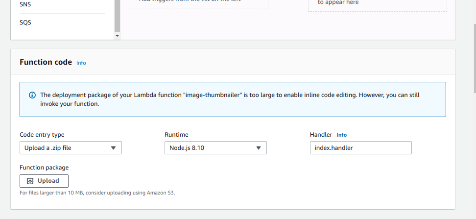
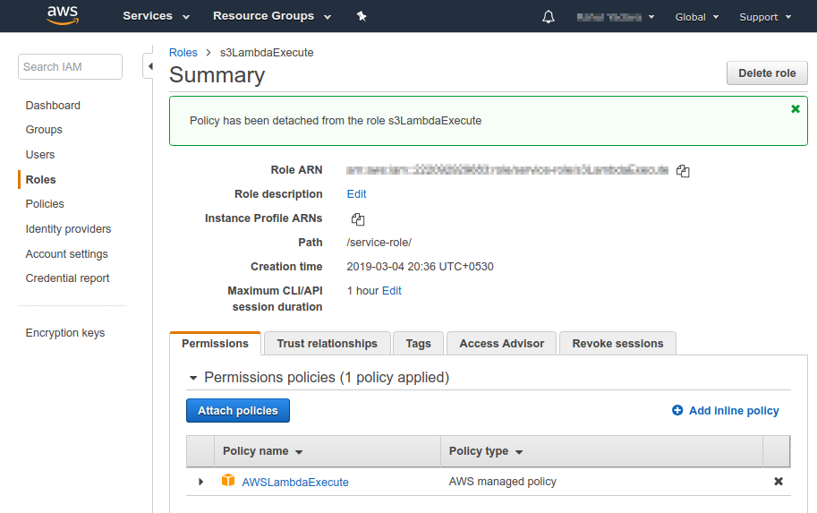
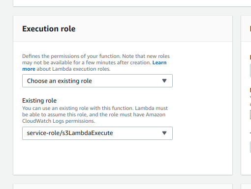
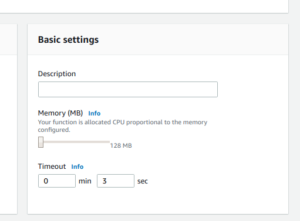
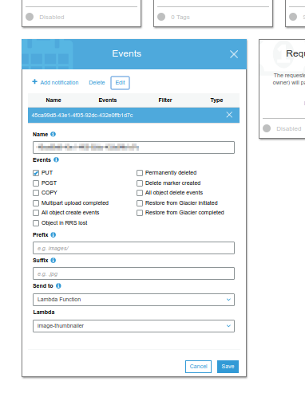

# aws-lambda-thumbnailer
aws Lambda Function for creating thumbnails of images uploaded to a s3 bucket

Uses  to resize images.

```
$ npm install
$ zip -r thumbnailer.zip index.js node_modules/ package.json package-lock.json
```

## Set up S3
Create a folder named 'thumbnails' in the bucket where you will be uploading images.
S3 bucket and the lambda function should be in the same region.

## Set up Lambda
1. Create a new Lambda from aws console
2. Goto Function code of the newly created Lambda and upload the thumbnailer.zip file



3. Create a new Role in IAM and attach AWSLambdaExecute policy



4. Select this role as your Lambda's Execution role



5. If the images are pretty large you can increase the timeout value in Lambda.

 

## Event notification
In you S3 bucket properties, add an event notification to notify Lambda whenever some file is uploaded to your bucket.




